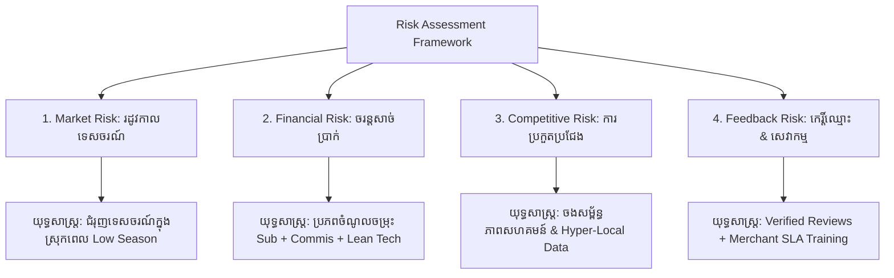

# 📑 ឯកសាររៀបចំស្លាយបទបង្ហាញគម្រោងអាជីវកម្ម (Pitch Deck Presentation)
## គម្រោង៖ SR TesChor (Siem Reap Tourism & Local Business Ecosystem)
### សម្រាប់៖ កម្មវិធីគាំទ្រសហគ្រិនភាព និងការប្រកួតប្រជែងអាជីវកម្ម (Khmer Enterprise - KE)

---

## 🎯 ស្លាយទី ១៖ ទំព័រមុខ និងទិដ្ឋភាពទូទៅ (Title & Executive Hook)
* **ឈ្មោះគម្រោង៖** **SR TesChor (អេស អ័រ ទេសចរ)**
* **Tagline/ពាក្យស្លោក៖** *"ស្វែងរកបទពិសោធន៍ថ្មី គាំទ្រអាជីវកម្មខ្មែរ ធ្វើដំណើរប្រកបដោយភាពវៃឆ្លាតនៅសៀមរាប"*
* **បេសកកម្ម (Mission)៖** កសាងប្រព័ន្ធអេកូឡូស៊ីទេសចរណ៍ឌីជីថលបែបឆ្លាតវៃ ដើម្បីភ្ជាប់ភ្ញៀវទេសចរទៅកាន់រមណីយដ្ឋាន និងអាជីវកម្មក្នុងស្រុកនៅខេត្តសៀមរាប ព្រមទាំងជួយលើកកម្ពស់សេដ្ឋកិច្ចសហគមន៍ និងសហគ្រាសធុនតូច និងមធ្យម (SMEs)។
* **ចក្ខុវិស័យ (Vision)៖** ក្លាយជា Super-Platform ទេសចរណ៍លេខ ១ ប្រចាំខេត្តសៀមរាប និងពង្រីកសក្តានុពលទៅទូទាំងប្រទេសកម្ពុជានៅឆ្នាំ ២០២៨។

---

## 👥 ស្លាយទី ២៖ ការកំណត់អតិថិជនគោលដៅ (Target Customer Segmentation)

គម្រោង **SR TesChor** ដំណើរការលើទម្រង់ **Multi-sided Platform (B2C & B2B)**៖

### ១. ផ្នែកអ្នកប្រើប្រាស់/ភ្ញៀវទេសចរ (B2C - Consumers):
* **ភ្ញៀវទេសចរជាតិ (Domestic Travelers):** យុវជន Gen Z, អ្នកធ្វើការការិយាល័យ, ក្រុមគ្រួសារ និងអ្នកចូលចិត្តធ្វើដំណើរចុងសប្តាហ៍មកកាន់សៀមរាប ដែលចង់ស្វែងរកទីតាំងប្លែកៗ (Hidden Gems), ហាងកាហ្វេស្អាតៗ និងការបញ្ចុះតម្លៃពិសេស។
* **ភ្ញៀវទេសចរអន្តរជាតិ (International FITs - Free Independent Travelers):** ភ្ញៀវបរទេសដែលធ្វើដំណើរដោយខ្លួនឯង ចង់បានព័ត៌មានសុក្រឹត ផែនទី GPS ជាក់លាក់ ប្រព័ន្ធរៀបចំកាលវិភាគដើរលេងដោយ AI (AI Trip Planner) និងការទូទាត់ប្រាក់រហ័សតាម Bakong KHQR។
* **អ្នកស្រឡាញ់វប្បធម៌ និងធម្មជាតិ (Eco & Cultural Tourists):** អ្នកដែលស្វែងរកបទពិសោធន៍សហគមន៍ពិតប្រាកដ (Authentic Local Experiences)។

### ២. ផ្នែកដៃគូអាជីវកម្មក្នុងស្រុក (B2B - Local Merchants & SMEs):
* **សេវាកម្មស្នាក់នៅ និងម្ហូបអាហារ៖** សណ្ឋាគារបែប Boutique, ផ្ទះសំណាក់ (Homestays), ភោជនីយដ្ឋានខ្មែរ និងហាងកាហ្វេក្នុងស្រុក។
* **សេវាដឹកជញ្ជូន និងមគ្គុទ្ទេសក៍៖** សមាគមរ៉ឺម៉កកង់បី/PassApp, អ្នកបើកបរតាក់ស៊ីទេសចរណ៍ និងមគ្គុទ្ទេសក៍ទេសចរណ៍ឯករាជ្យ។
* **សិប្បកម្ម និងវប្បធម៌៖** ភូមិសិប្បកម្មចម្លាក់, កន្លែងត្បាញសូត្រ, ស្ប៉ា និងសិល្បៈវប្បធម៌ (Apsara/Phare Circus)។

---

## ⚠️ ស្លាយទី ៣៖ បញ្ហាប្រឈម និងដំណោះស្រាយ (Problem & Solution)

| បញ្ហាប្រឈមក្នុងទីផ្សារបច្ចុប្បន្ន (The Problems) | ដំណោះស្រាយរបស់ SR TesChor (Our Solutions) |
| :--- | :--- |
| **១. ព័ត៌មានរាយប៉ាយ និងមិនច្បាស់លាស់៖** ភ្ញៀវពិបាកស្វែងរកទីតាំងពិត ម៉ោងបើក/បិទ ឬតម្លៃសំបុត្រប្រាសាទ និងកន្លែងកម្សាន្ត។ | **ប្រព័ន្ធទិន្នន័យរួម និងផ្ទៀងផ្ទាត់ (Verified Directory):** ព័ត៌មានទីតាំង GPS ពិតប្រាកដ, តម្លៃ, ម៉ោងដំណើរការ, និងរូបភាពជាក់ស្តែង។ |
| **២. ពិបាករៀបចំកាលវិភាគដើរលេង៖** ភ្ញៀវខាតពេល និងសាំងដោយសាររៀបចំផ្លូវដើរទស្សនាមិនត្រូវលំដាប់លំដោយ។ | **AI Smart Itinerary Planner:** បង្កើតកាលវិភាគដើរលេងស្វ័យប្រវត្តិតាមថវិកា និងចំណង់ចំណូលចិត្តត្រឹមតែ ១០ វិនាទី។ |
| **៣. អាជីវកម្មក្នុងស្រុកខ្វះលទ្ធភាពប្រកួតប្រជែង៖** វេទិកាអន្តរជាតិ (OTAs ដូចជា Agoda/Booking) កាត់កម្រៃជើងសារខ្ពស់ពេក (១៥% - ២៥%)។ | **កម្រៃជើងសារទាប និងសមរម្យ (៥% - ១០%):** ជួយសន្សំប្រាក់ចំណេញដល់ម្ចាស់អាជីវកម្មខ្មែរ និងមានគម្រោង Subscription ចាប់ពី $០។ |
| **៤. ឧបសគ្គនៃការទូទាត់ប្រាក់៖** ភ្ញៀវពិបាកបង់ប្រាក់កក់ ឬត្រូវប្រើសាច់ប្រាក់សុទ្ធ។ | **ប្រព័ន្ធទូទាត់ Bakong KHQR & Digital Invoice:** ស្កេនទូទាត់ភ្លាមៗជាមួយធនាគារទាំងអស់នៅកម្ពុជា និងមានវិក្កយបត្រ E-Invoice ស្តង់ដារ។ |

---

## 🏆 ស្លាយទី ៤៖ ការប្រៀបធៀបគូប្រកួតប្រជែង និងភាពលេចធ្លោ (Competitor Analysis & Unique Selling Proposition - USP)

### តារាងប្រៀបធៀបទីផ្សារ (Competitive Matrix)

| លក្ខណៈពិសេស (Features) | វេទិកាអន្តរជាតិ (Tripadvisor / Agoda) | បណ្តាញសង្គម (Facebook / TikTok) | **SR TesChor (គម្រោងរបស់យើង)** |
| :--- | :---: | :---: | :---: |
| **ការយល់ដឹងស៊ីជម្រៅពីសៀមរាប (Hyper-local Depth)** | មធ្យម (ផ្តោតតែកន្លែងធំៗ) | រាយប៉ាយ មិនមានប្រព័ន្ធ | **ខ្ពស់បំផុត (100% Focused on Siem Reap)** |
| **AI Trip Planner ស្វ័យប្រវត្តិ** | ❌ គ្មាន | ❌ គ្មាន | **✅ មាន (រៀបចំតាមថវិកា និងចំនួនថ្ងៃ)** |
| **ការទូទាត់ Bakong KHQR** | ❌ គ្មាន (កាតអន្តរជាតិ) | ❌ គ្មាន | **✅ គាំទ្រ KHQR ពេញលេញ (NBC Standard)** |
| **កម្រៃជើងសារពីអាជីវកម្ម (Commission)** | ខ្ពស់ (15% - 25%) | 0% (តែត្រូវចំណាយថ្លៃ Boost ថ្លៃ) | **សមរម្យបំផុត (5% - 10% ឬ Flat Sub)** |
| **ប្រព័ន្ធចាប់ទីតាំង GPS ស្វ័យប្រវត្តិ** | ❌ ត្រូវវាយបញ្ចូលដោយដៃ | ❌ មិនជាក់លាក់ | **✅ ចាប់យកកូអរដោនេ & អាសយដ្ឋានដោយស្វ័យប្រវត្តិ** |
| **វិក្កយបត្រ Digital E-Invoice (USD/KHR)** | ❌ គ្មានរូបិយប័ណ្ណរៀល | ❌ គ្មាន | **✅ មានទម្រង់ពន្ធដារ និងអត្រាការប្រាក់ NBC** |

### ✨ ភាពពិសេសដែលគ្មានពីរ (Unique Selling Proposition - USP):
1. **Hyper-Local Ecosystem:** មិនមែនគ្រាន់តែជាបញ្ជីឈ្មោះនោះទេ តែជាប្រព័ន្ធរួមបញ្ចូលគ្នារវាង *រមណីយដ្ឋាន + អាជីវកម្មក្នុងស្រុក + ប្រព័ន្ធកក់ + ការទូទាត់ KHQR + AI Planner* ក្នុង App/Web តែមួយ។
2. **National Financial Integration:** តភ្ជាប់ប្រព័ន្ធទូទាត់ជាតិបាគង (KHQR) អនុញ្ញាតឱ្យសូម្បីតែអ្នកលក់រ៉ឺម៉កកង់បី ឬតូបសិប្បកម្មតូចតាច ក៏អាចទទួលការកក់ និងលុយបានស្រួល។
3. **Smart AI Assistant:** ជួយភ្ញៀវទេសចររៀបចំកាលវិភាគទស្សនាតាមតំបន់ (Small Circuit, Grand Circuit, Roluos Group) ដោយមិនបាច់ឈឺក្បាលគិត។

---

## 💰 ស្លាយទី ៥៖ គំរូអាជីវកម្ម សេវាកម្ម និងការកំណត់តម្លៃ (Business Model, Services & Pricing)

**SR TesChor** រកប្រាក់ចំណូលតាមរយៈ **៤ ប្រភពធំៗ (Diversified Revenue Streams)**៖

```
                    ┌──────────────────────────────────────────────┐
                    │          SR TESCHOR REVENUE ENGINE           │
                    └──────────────────────┬───────────────────────┘
                                           │
         ┌──────────────────┬──────────────┴─────┬──────────────────┐
         ▼                  ▼                    ▼                  ▼
┌─────────────────┐ ┌────────────────┐ ┌───────────────────┐ ┌───────────────┐
│ B2B Subscription│ │Booking Commis. │ │ Banner Ads & Top  │ │Digital Pass & │
│ Plans ($0-$20/m)│ │  (5% - 10%)    │ │ Listing ($15-$50) │ │ Commission    │
└─────────────────┘ └────────────────┘ └───────────────────┘ └───────────────┘
```

### ១. សេវាសមាជិកភាពសម្រាប់អាជីវកម្ម (B2B SaaS Subscription):
* **គម្រោង FREE ($0/ខែ):** បង្កើត Profile មូលដ្ឋាន, ដាក់រូបភាព ៥ សន្លឹក, បង្ហាញក្នុង Directory (សម្រាប់ជួយអាជីវកម្មទើបបង្កើតថ្មី)។
* **គម្រោង PRO ($10/ខែ):** ជាប់ចំណាត់ថ្នាក់លើគេក្នុង Category, បង្កើត Promotion/Discount Codes, ទទួលបានប្រព័ន្ធ Booking ផ្ទាល់, មើល Analytics។
* **គម្រោង VIP PREMIUM ($20/ខែ):** បង្ហាញមុខលើ Homepage Hero Spotlight, ផ្លាកសញ្ញា Gold Verified Partner, Zero Booking Fee, គាំទ្រផ្នែកទីផ្សារអាទិភាព។

### ២. កម្រៃជើងសារពីការកក់សេវាកម្ម (Booking Commission Fee):
* យកត្រឹមតែ **៥% ទៅ ១០%** ពីការកក់កញ្ចប់ដំណើរកម្សាន្ត (Tour Packages) ឬសេវាកម្មសណ្ឋាគារ/ស្ប៉ា (ធៀបនឹង OTA បរទេសដែលយក ២០%+)។

### ៣. សេវាផ្សព្វផ្សាយពិសេស (Featured Promotion & Banner Advertising):
* ការដាក់ Banner ផ្សព្វផ្សាយនៅលើគេហទំព័រដើម ($១៥ - $៥០/ខែ) សម្រាប់ម៉ាកយីហោធំៗ។

### ៤. កម្រៃពីការលក់ Digital Tour Pass & Vouchers:
* សេវាលក់ Voucher បញ្ចុះតម្លៃឌីជីថល និងកញ្ចប់ Combo Pass ដើរលេងសៀមរាប។

---

## 🛡️ ស្លាយទី ៦៖ ការវិភាគហានិភ័យ និងយុទ្ធសាស្ត្រទប់ស្កាត់ (Comprehensive Risk Analysis & Mitigation)



### ១. ហានិភ័យនៃទីផ្សារ (Market Risk)
* **បញ្ហាប្រឈម៖** វិស័យទេសចរណ៍នៅសៀមរាបមានរដូវកាលច្បាស់លាស់ (High Season: វិច្ឆិកា-មីនា និង Low Season: ឧសភា-កញ្ញា) ដែលអាចធ្វើឱ្យចំនួនអ្នកប្រើប្រាស់ធ្លាក់ចុះនៅរដូវភ្លៀង។
* **យុទ្ធសាស្ត្រទប់ស្កាត់ (Mitigation):** 
  * នៅរដូវ Low Season វេទិកានឹងបង្វែរយុទ្ធសាស្ត្រមក **ជំរុញទេសចរណ៍ក្នុងស្រុក (Domestic Weekend Getaways)** តាមរយៈការសហការជាមួយអាជីវកម្មក្នុងស្រុកដើម្បីផ្តល់ប្រូម៉ូសិនបញ្ចុះតម្លៃពិសេស (Staycation & Cafe Hopping)។

### ២. ហានិភ័យផ្នែកហិរញ្ញវត្ថុ (Financial Risk)
* **បញ្ហាប្រឈម៖** ការចំណាយលើការថែទាំ Server/Cloud និងយុទ្ធនាការទីផ្សារអាចខ្ពស់ជាងចំណូលក្នុងដំណាក់កាលដំបូង។
* **យុទ្ធសាស្ត្រទប់ស្កាត់ (Mitigation):**
  * អនុវត្តគំរូ **Lean Startup & Scalable Cloud Architecture** (ប្រើប្រាស់ Caching, Code Splitting ដើម្បីកាត់បន្ថយថ្លៃ Server)។
  * រក្សាចរន្តសាច់ប្រាក់ថេរតាមរយៈ **Monthly Subscriptions ពីអាជីវកម្ម** ជាជាងពឹងផ្អែកតែលើ Commission តែមួយមុខ។

### ៣. ហានិភ័យនៃការប្រកួតប្រជែង (Competitive Risk)
* **បញ្ហាប្រឈម៖** ក្រុមហ៊ុនយក្សអន្តរជាតិ (Google Maps, Tripadvisor, Grab) ឬក្រុមហ៊ុនក្នុងស្រុកធំៗអាចបង្កើតមុខងារស្រដៀងគ្នា។
* **យុទ្ធសាស្ត្រទប់ស្កាត់ (Mitigation):**
  * **Hyper-Local Focus & Community Trust:** ចុះកិច្ចព្រមព្រៀងផ្តាច់មុខជាមួយសមាគមអាជីវកម្ម និងមគ្គុទ្ទេសក៍នៅសៀមរាប។
  * ផ្តល់សេវាកម្មបម្រើអតិថិជនជាភាសាខ្មែរផ្ទាល់ ២៤/៧ និងការទូទាត់ប្រាក់ KHQR ដោយផ្ទាល់ដែលវេទិកាបរទេសមិនអាចប្រកួតបាន។

### ៤. ហានិភ័យនៃការវាយតម្លៃ និងឆ្លើយតប (Feedback & Reputation Risk)
* **បញ្ហាប្រឈម៖** ការ Review ក្លែងក្លាយ (Fake Reviews), ការខកចិត្តពីភ្ញៀវដោយសារអាជីវកម្មផ្តល់សេវាមិនបានល្អ ឬកំហុសបច្ចេកទេសលើវេបសាយ។
* **យុទ្ធសាស្ត្រទប់ស្កាត់ (Mitigation):**
  * **Verified Purchase Reviews:** អនុញ្ញាតឱ្យសរសេរ Review បានលុះត្រាតែមានការ Check-in ឬកក់សេវាពិតប្រាកដ។
  * **Merchant Quality Standards:** កំណត់លក្ខខណ្ឌតឹងរ៉ឹងលើការផ្ទៀងផ្ទាត់អាជីវកម្ម (Business Verification) និងមានប្រព័ន្ធដោះស្រាយវិវាទ (Dispute Resolution) រហ័សក្នុងរយៈពេល ២៤ ម៉ោង។

---

## 💻 ស្លាយទី ៧៖ ស្ថាបត្យកម្មបច្ចេកវិទ្យា និងនវានុវត្តន៍ (Technology & Innovation)

* **Frontend (បទពិសោធន៍អ្នកប្រើប្រាស់):** React, Tailwind CSS, Lucide Icons, Leaflet Maps, និង PWA Caching (ផ្ទុកលឿន ក្រោម 1.2 វិនាទី)។
* **Backend (ម៉ាស៊ីនដំណើរការស្នូល):** Laravel API, MySQL, Redis/File Caching System, និង RESTful Architecture។
* **Fintech Engine:** **Bakong KHQR EMVCo Generator** ជាមួយក្បួនគណនា CRC-16 Checksum និងការផ្ទៀងផ្ទាត់ការទូទាត់ Real-time។
* **AI Engine:** ការរួមបញ្ចូលជាមួយ **Gemini AI API** ដើម្បីរៀបចំគម្រោងដំណើរកម្សាន្តឆ្លាតវៃ (Customized Daily Route & Budget Calculation)។

---

## 📈 ស្លាយទី ៨៖ ផែនការអភិវឌ្ឍន៍ និងផលជះដល់សង្គម (Roadmap & Socio-Economic Impact)

### ១. ផែនការអនុវត្ត ៣ ដំណាក់កាល (Execution Roadmap):
* **ដំណាក់កាលទី ១ (ត្រីមាសទី ៣-៤ ឆ្នាំ ២០២៦):** ពង្រឹងទីផ្សារនៅសៀមរាប ទទួលបានអាជីវកម្មដៃគូ ៣០០+ និងអ្នកប្រើប្រាស់ ៥០,០០០ នាក់/ខែ។
* **ដំណាក់កាលទី ២ (ឆ្នាំ ២០២៧):** បើកដំណើរការ Mobile Native App (iOS & Android) និងប្រព័ន្ធ Smart Audio Tour Guide។
* **ដំណាក់កាលទី ៣ (ឆ្នាំ ២០២៨):** ពង្រីកប្រព័ន្ធទៅកាន់ខេត្តទេសចរណ៍ផ្សេងទៀតដូចជា រាជធានីភ្នំពេញ កំពត កែប និងមណ្ឌលគិរី។

### ២. ផលជះវិជ្ជមានដល់សង្គម និងសេដ្ឋកិច្ច (Socio-Economic Impact):
* **លើកកម្ពស់សេដ្ឋកិច្ចមូលដ្ឋាន (Local Economic Growth):** ជួយអាជីវកម្មខ្នាតតូច និងសិប្បករខ្មែរឱ្យមានវត្តមានលើឌីជីថលដោយមិនបាច់ចំណាយទុនច្រើន។
* **លើកស្ទួយទេសចរណ៍ប្រកបដោយចីរភាព (Sustainable Tourism):** ជួយបែងចែកភ្ញៀវទេសចរឱ្យទៅកម្សាន្តនៅតំបន់សហគមន៍ក្រៅពីប្រាសាទអង្គរវត្ត ដើម្បីបង្កើតចំណូលស្មើភាពគ្នាក្នុងខេត្ត។
* **ជំរុញសង្គមឌីជីថល (Digital Literacy):** ជួយបណ្តុះបណ្តាលម្ចាស់អាជីវកម្មក្នុងស្រុកឱ្យចេះប្រើប្រាស់បច្ចេកវិទ្យា និងការទូទាត់ឌីជីថល KHQR។

---

## 🤝 ស្លាយទី ៩៖ សំណើគាំទ្រពី Khmer Enterprise (The Ask & Partnership)

ដើម្បីពន្លឿនការរីកចម្រើនរបស់គម្រោង **SR TesChor** យើងខ្ញុំស្នើសុំការគាំទ្រពី **Khmer Enterprise (សហគ្រិនខ្មែរ)** លើ ៣ ចំណុចសំខាន់៖
1. **ការគាំទ្រថវិកាពង្រីកទីផ្សារ (Grant / Seed Funding):** សម្រាប់យុទ្ធនាការផ្សព្វផ្សាយ និងការចុះឈ្មោះអាជីវកម្មក្នុងស្រុកនៅសៀមរាបឱ្យបាន ៥០០ អាជីវកម្មដំបូង។
2. **ការប្រឹក្សាយោបល់ និងការបណ្តុះបណ្តាល (Mentorship & Incubation):** ពីអ្នកជំនាញដើម្បីពង្រឹងរចនាសម្ព័ន្ធហិរញ្ញវត្ថុ និងយុទ្ធសាស្ត្រ Scale-up។
3. **បណ្តាញទំនាក់ទំនងអាជីវកម្ម (Business Networking):** ភ្ជាប់ទំនាក់ទំនងជាមួយក្រសួងទេសចរណ៍ សមាគមសណ្ឋាគារ និងដៃគូធនាគារនានានៅកម្ពុជា។

---

## 🏁 ស្លាយទី ១០៖ ការសន្និដ្ឋាន (Conclusion & Call to Action)

> *"SR TesChor មិនមែនគ្រាន់តែជាវេបសាយទេសចរណ៍ប៉ុណ្ណោះទេ ប៉ុន្តែជាស្ពានឌីជីថលតភ្ជាប់ពិភពលោកមកកាន់បេះដូងនៃទឹកដីប្រវត្តិសាស្ត្រសៀមរាប និងជាដៃគូដ៏រឹងមាំរបស់សហគ្រិនខ្មែរគ្រប់រូប។"*

* **ទំនាក់ទំនងក្រុមការងារ៖**
  * 📧 Email: `contact@srteschor.com` | 🌐 Website: `www.srteschor.com`
  * 📱 Telegram: `@srteschor_team` | 📍 ទីតាំង៖ ក្រុងសៀមរាប ខេត្តសៀមរាប
